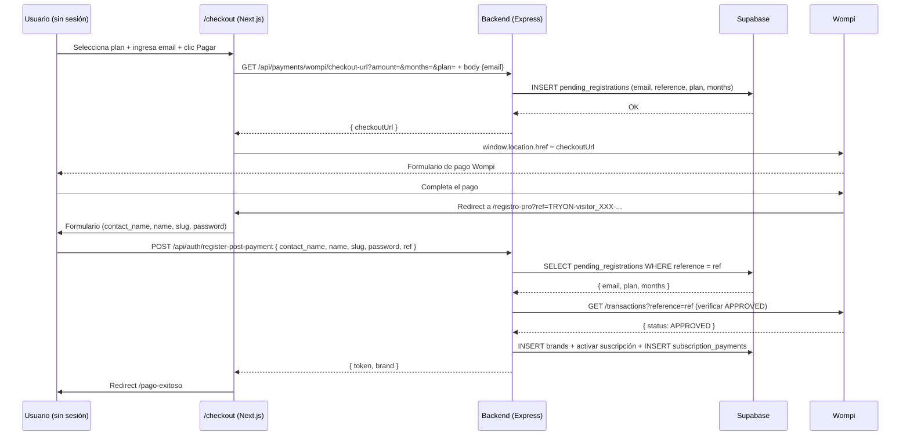
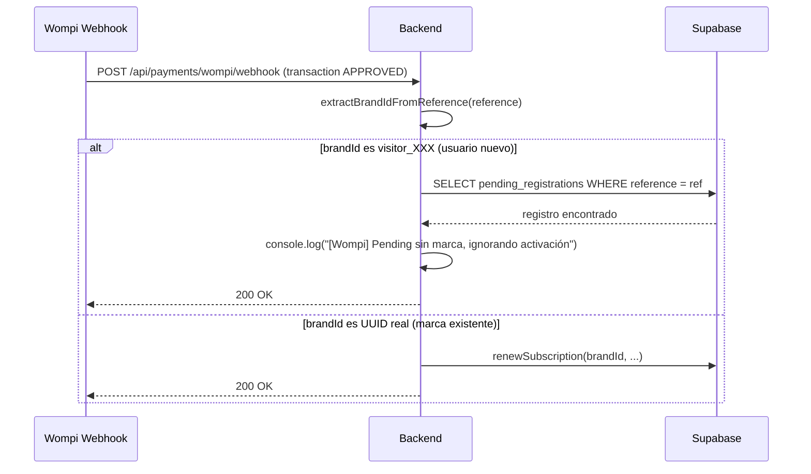

# Design Document — checkout-email-registro-pro

## Overview

El flujo actual de pago para usuarios nuevos tiene un problema crítico: si el usuario paga en Wompi pero no completa el formulario de `/registro-pro`, el pago queda huérfano sin ningún registro en el sistema. Esta feature resuelve eso capturando el email **antes** de generar la URL de Wompi, persistiéndolo en una tabla `pending_registrations`, y usando ese email para completar el registro post-pago sin pedírselo de nuevo al usuario.

Cambios en tres capas:
1. **Frontend `/checkout`**: agrega campo de email para usuarios sin sesión
2. **Backend `GET /api/payments/wompi/checkout-url`**: crea `pending_registration` antes de retornar la URL
3. **Backend `POST /api/auth/register-post-payment`**: recibe `ref` en lugar de `email`, busca el pending y verifica el pago con Wompi API
4. **Frontend `/registro-pro`**: elimina campos email y teléfono, muestra error si no hay `?ref=`
5. **Webhook Wompi**: detecta referencias con pending sin marca → solo loguea, no activa

---

## Architecture





---

## Components and Interfaces

### Nuevos / modificados en Backend

#### `pending_registrations` — tabla Supabase (nueva)
Ver sección Data Models.

#### `GET /api/payments/wompi/checkout-url` — modificado
Archivo: `backend/src/controllers/wompi.controller.ts` → método `getCheckoutUrl`

Cambios:
- Acepta `email` como query param opcional: `?email=hola@marca.com&amount=250000&months=1&plan=PRO`
- Si no hay sesión (`!brand?.id`) **y** hay `email` → crea `pending_registration` antes de retornar la URL
- Si falla la inserción en BD → retorna 500 (no redirigir al usuario a Wompi sin el pending)
- La `redirectUrl` para usuarios sin sesión cambia a `/registro-pro?ref={reference}` (incluye la referencia)

```typescript
// Firma del método actualizado
async getCheckoutUrl(req: Request, res: Response): Promise<void>
// Query params: amount, months, plan, email (nuevo, opcional)
```

#### `POST /api/auth/register-post-payment` — modificado
Archivo: `backend/src/controllers/auth-post-payment.controller.ts`

Cambios:
- Recibe `ref` en el body en lugar de `email`
- Busca `pending_registrations` por `reference = ref` usando `supabaseAdmin`
- Si no existe → 404 `"Referencia de pago no encontrada"`
- Verifica transacción con Wompi API (`wompiService.getTransactionByReference(ref)`)
- Si no está `APPROVED` → 402 `"El pago no ha sido confirmado aún"`
- Usa `email`, `plan` y `months` del pending para crear la cuenta y activar la suscripción
- Envía email de verificación de forma asíncrona (igual que antes)

```typescript
// Body esperado (nuevo)
interface RegisterPostPaymentBody {
  contact_name: string;
  name: string;
  slug: string;
  password: string;
  ref: string;          // referencia de Wompi (antes era email)
  fingerprint?: string;
}
```

#### `WompiService` — método nuevo
Archivo: `backend/src/services/wompi.service.ts`

Agregar método `getTransactionByReference`:

```typescript
async getTransactionByReference(reference: string): Promise<{ status: string } | null>
// GET https://sandbox.wompi.co/v1/transactions?reference={reference}
// Retorna el primer resultado o null si no existe
```

#### `POST /api/payments/wompi/webhook` — modificado
Archivo: `backend/src/controllers/wompi.controller.ts` → método `handleWebhook`

Cambios en la lógica de detección de brandId:
- Si `brandId` empieza con `visitor_` → verificar si existe en `pending_registrations`
  - Si existe → loguear y retornar 200 sin activar nada
  - Si no existe → loguear como referencia desconocida y retornar 200
- Si `brandId` es un UUID real → flujo actual de renovación (sin cambios)

### Nuevos / modificados en Frontend

#### `/checkout/page.tsx` — modificado
Cambios:
- Agregar estado `email` y `emailError`
- Detectar sesión activa: `const hasSession = !!localStorage.getItem('token')`
- Si `!hasSession` → renderizar campo de email antes del botón "Pagar"
- Validar formato de email antes de llamar a `handlePagar`
- Pasar `email` como query param en la llamada a `checkout-url`: `?...&email=${encodeURIComponent(email)}`

#### `/registro-pro/page.tsx` — modificado
Cambios:
- Eliminar campo `email` del estado del formulario y del JSX
- Eliminar campo `phone` del estado del formulario y del JSX
- Eliminar validación de email del método `validate()`
- Si `!ref` al cargar → mostrar bloque de error en lugar del formulario
- En `handleSubmit` → enviar `ref` en el body (ya lo hace, pero eliminar `email` y `phone`)

---

## Data Models

### Nueva tabla: `pending_registrations`

```sql
CREATE TABLE pending_registrations (
  id          uuid        PRIMARY KEY DEFAULT gen_random_uuid(),
  email       text        NOT NULL,
  reference   text        NOT NULL,
  plan        text        NOT NULL,
  months      integer     NOT NULL,
  created_at  timestamptz NOT NULL DEFAULT now(),
  CONSTRAINT pending_registrations_reference_key UNIQUE (reference)
);

-- RLS: deshabilitado (solo acceso desde service role via supabaseAdmin)
ALTER TABLE pending_registrations DISABLE ROW LEVEL SECURITY;
```

Script de migración: ejecutar manualmente en Supabase SQL Editor.

### Cambios en tablas existentes
Ninguno. La tabla `brands` y `subscription_payments` no se modifican.

---

## Correctness Properties

*A property is a characteristic or behavior that should hold true across all valid executions of a system — essentially, a formal statement about what the system should do. Properties serve as the bridge between human-readable specifications and machine-verifiable correctness guarantees.*

### Property 1: Emails inválidos son rechazados en checkout

*For any* string que no cumpla el formato `[^\s@]+@[^\s@]+\.[^\s@]+` (sin @, sin dominio, con espacios, vacío), el frontend de checkout debe rechazarlo y no llamar al endpoint de checkout-url.

**Validates: Requirements 1.2**

---

### Property 2: Pending registration round-trip

*For any* combinación válida de email, plan y months, cuando el backend procesa una solicitud de checkout-url sin sesión, la referencia retornada en `checkoutUrl` debe existir en `pending_registrations` con el mismo email, plan y months.

**Validates: Requirements 2.1, 2.5**

---

### Property 3: Referencia inexistente retorna 404

*For any* string que no corresponda a una referencia existente en `pending_registrations`, el endpoint `POST /api/auth/register-post-payment` debe retornar HTTP 404.

**Validates: Requirements 4.2**

---

### Property 4: Email del pending se propaga a la cuenta creada

*For any* pending_registration válido con transacción APPROVED, el email de la marca creada por `register-post-payment` debe ser idéntico al email almacenado en ese pending_registration.

**Validates: Requirements 4.1, 4.3**

---

### Property 5: Transacción no aprobada bloquea el registro

*For any* referencia en `pending_registrations` cuya transacción en Wompi tenga estado distinto de `APPROVED` (o no exista), el endpoint `register-post-payment` debe retornar HTTP 402.

**Validates: Requirements 5.1, 5.2**

---

### Property 6: Plan y months del pending se usan en la suscripción

*For any* pending_registration con transacción APPROVED, el plan y months de la suscripción activada deben ser iguales a los valores almacenados en ese pending_registration.

**Validates: Requirements 5.3**

---

### Property 7: Webhook ignora referencias con pending sin marca

*For any* referencia cuyo brandId extraído empiece con `visitor_` y exista en `pending_registrations`, el webhook de Wompi no debe modificar ninguna fila en `brands` ni en `subscription_payments`.

**Validates: Requirements 7.1, 7.3**

---

### Property 8: Webhook procesa renovaciones de marcas existentes sin cambios

*For any* referencia cuyo brandId sea un UUID válido existente en `brands`, el webhook debe actualizar `subscription_end_date` e insertar en `subscription_payments` (comportamiento actual sin regresión).

**Validates: Requirements 7.2**

---

## Error Handling

| Escenario | Capa | Respuesta |
|-----------|------|-----------|
| Email inválido en checkout | Frontend | Mensaje de error inline, no llama al backend |
| Fallo al insertar `pending_registration` | Backend `getCheckoutUrl` | HTTP 500, no retorna checkoutUrl |
| `ref` ausente en `/registro-pro` | Frontend | Bloque de error visible, formulario oculto |
| `ref` no encontrada en `pending_registrations` | Backend `register-post-payment` | HTTP 404 `"Referencia de pago no encontrada"` |
| Transacción Wompi no APPROVED | Backend `register-post-payment` | HTTP 402 `"El pago no ha sido confirmado aún"` |
| Fallo al llamar API de Wompi | Backend `register-post-payment` | HTTP 502 `"Error al verificar el pago con Wompi"` |
| Email ya registrado en `brands` | Backend `register-post-payment` | HTTP 409 (comportamiento existente de `authService.register`) |
| Fallo al enviar email de verificación | Backend `register-post-payment` | Solo `console.error`, no bloquea la respuesta |
| Webhook con referencia `visitor_` sin pending | Backend `handleWebhook` | `console.warn` + HTTP 200 (no error) |

---

## Testing Strategy

### Unit tests (ejemplos específicos y casos de error)

Archivos nuevos:
- `backend/src/controllers/__tests__/wompi-checkout-url.test.ts`
- `backend/src/controllers/__tests__/auth-post-payment.test.ts`

Casos a cubrir con unit tests:
- `getCheckoutUrl` sin sesión + email válido → crea pending y retorna URL
- `getCheckoutUrl` sin sesión + sin email → no crea pending (flujo legacy)
- `getCheckoutUrl` con sesión → no crea pending (flujo existente)
- `register-post-payment` sin `ref` → 400
- `register-post-payment` con `ref` válida + pago APPROVED → 201 con token
- `register-post-payment` → email de verificación se llama con el email del pending
- `register-post-payment` → fallo en sendEmail no propaga error
- `handleWebhook` con `visitor_` + pending existente → no toca `brands`
- Formulario `/registro-pro` sin `?ref=` → muestra error

### Property-based tests

Librería: **fast-check** (TypeScript, compatible con Jest/Vitest)

Configuración: mínimo 100 iteraciones por propiedad (`numRuns: 100`).

Archivo: `backend/src/__tests__/properties/checkout-email-registro-pro.property.test.ts`

```typescript
// Ejemplo de estructura para cada propiedad:

// Feature: checkout-email-registro-pro, Property 1: Emails inválidos son rechazados
it('Property 1: invalid emails are rejected', () => {
  fc.assert(fc.property(
    fc.oneof(
      fc.string().filter(s => !s.includes('@')),
      fc.constant(''),
      fc.constant('   '),
    ),
    (invalidEmail) => {
      expect(isValidEmail(invalidEmail)).toBe(false);
    }
  ), { numRuns: 100 });
});

// Feature: checkout-email-registro-pro, Property 2: Pending registration round-trip
// Feature: checkout-email-registro-pro, Property 3: Referencia inexistente retorna 404
// Feature: checkout-email-registro-pro, Property 4: Email del pending se propaga a la cuenta
// Feature: checkout-email-registro-pro, Property 5: Transacción no aprobada bloquea registro
// Feature: checkout-email-registro-pro, Property 6: Plan y months del pending en suscripción
// Feature: checkout-email-registro-pro, Property 7: Webhook ignora referencias visitor_ con pending
// Feature: checkout-email-registro-pro, Property 8: Webhook procesa renovaciones sin regresión
```

Cada test de propiedad debe:
- Referenciar la propiedad del diseño en un comentario
- Usar mocks de `supabaseAdmin` y `wompiService` para aislar la lógica
- Ejecutar con `numRuns: 100` mínimo
