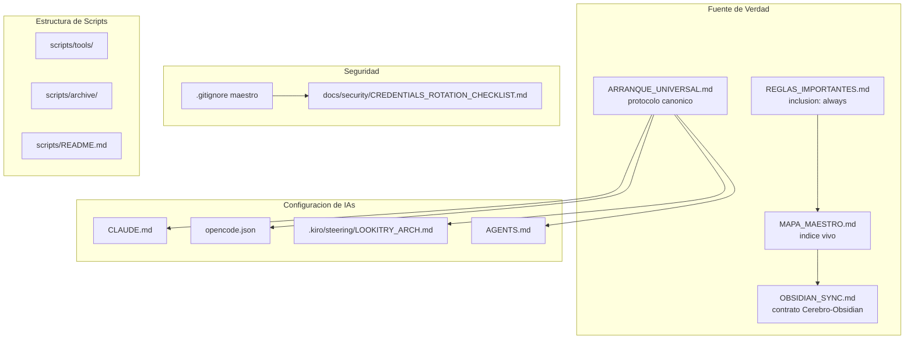
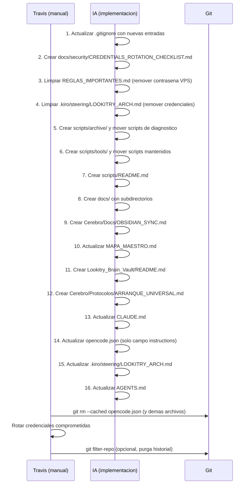

# Design Document: project-organization-cerebro-sync

## Overview

Este feature reorganiza la infraestructura de conocimiento y configuracion de Lookitry en cinco areas: limpieza de credenciales expuestas en git, estructura clara de `scripts/` y `docs/`, formalizacion de la conexion Cerebro-Obsidian, protocolo universal de arranque para todas las IAs, y actualizacion del `.gitignore` maestro.

El enfoque es puramente documental y de configuracion — no hay cambios al codigo de la aplicacion (frontend/backend). Todos los archivos creados son Markdown, JSON o entradas en `.gitignore`. La rotacion de credenciales es responsabilidad exclusiva del usuario (Travis); las IAs solo documentan que rotar y como.

---

## Arquitectura General



---

## Componentes y Decisiones de Diseno

### Componente 1: Limpieza de Credenciales

**Problema central**: Varios archivos con secretos reales estan trackeados en git. El repo es privado hoy, pero eso no es garantia suficiente.

**Archivos comprometidos identificados**:

| Archivo | Credencial | Servicio |
|---------|-----------|---------|
| `opencode.json` | MiniMax API key, Groq API key | MiniMax, Groq |
| `opencode.json` | Telegram bot token | Telegram |
| `opencode.json` | Hostinger API token | Hostinger VPS |
| `opencode.json` | n8n JWT | n8n |
| `scripts/n8n_api_key.txt` | JWT de n8n | n8n |
| `scripts/id_rsa_lookitry` | Clave SSH privada | VPS 31.220.18.39 |
| `bedrock-long-term-api-key.csv` | Credenciales AWS Bedrock | AWS |
| `REGLAS_IMPORTANTES.md` | Contrasena VPS en texto plano | VPS 31.220.18.39 |
| `.kiro/steering/LOOKITRY_ARCH.md` | Telegram token, n8n JWT, Hostinger token, Context7 key | Multiples |

**Nota critica sobre LOOKITRY_ARCH.md**: El steering file de Kiro contiene credenciales reales en la seccion "Credenciales MCP". Estas deben ser reemplazadas por referencias a variables de entorno o al archivo `.env` correspondiente.

**Diseno de la solucion**:

1. Actualizar `.gitignore` para excluir los archivos comprometidos (ver Componente 5).
2. Crear `docs/security/CREDENTIALS_ROTATION_CHECKLIST.md` con la lista completa, los comandos `git rm --cached` necesarios, y la advertencia de que el historial de git requiere `git filter-repo` para purga completa.
3. Limpiar `REGLAS_IMPORTANTES.md`: reemplazar la contrasena VPS por una referencia a `backend/.env`.
4. Limpiar `.kiro/steering/LOOKITRY_ARCH.md`: reemplazar los valores reales de credenciales por placeholders del tipo `[ver backend/.env o opencode.json local]`.

**Restriccion de diseno**: Las IAs NO rotan credenciales. El checklist documenta que rotar; Travis ejecuta la rotacion manualmente.

**Estructura de `docs/security/CREDENTIALS_ROTATION_CHECKLIST.md`**:

```markdown
# Checklist de Rotacion de Credenciales

## Estado: PENDIENTE DE ROTACION

## Credenciales a Rotar

| Servicio | Archivo Comprometido | Variable/Campo | Prioridad |
|---------|---------------------|----------------|-----------|
| VPS SSH | scripts/id_rsa_lookitry | clave privada RSA | CRITICA |
| VPS Password | REGLAS_IMPORTANTES.md | seccion VPS PRODUCCION | CRITICA |
| n8n JWT | scripts/n8n_api_key.txt, opencode.json | N8N_API_KEY | ALTA |
| Telegram Bot | opencode.json | TELEGRAM_BOT_TOKEN | ALTA |
| Hostinger API | opencode.json | API_TOKEN | ALTA |
| MiniMax API | opencode.json | api key | ALTA |
| Groq API | opencode.json | api key | MEDIA |
| AWS Bedrock | bedrock-long-term-api-key.csv | access key + secret | ALTA |

## Comandos git rm --cached

# Ejecutar desde la raiz del repositorio:
git rm --cached opencode.json
git rm --cached scripts/n8n_api_key.txt
git rm --cached scripts/id_rsa_lookitry
git rm --cached bedrock-long-term-api-key.csv

## Advertencia: Historial de Git

Los archivos removidos del tracking siguen existiendo en el historial de commits.
Para purga completa del historial, ejecutar git filter-repo (requiere autorizacion de Travis):

pip install git-filter-repo
git filter-repo --path opencode.json --invert-paths
git filter-repo --path scripts/n8n_api_key.txt --invert-paths
git filter-repo --path scripts/id_rsa_lookitry --invert-paths
git filter-repo --path bedrock-long-term-api-key.csv --invert-paths

ADVERTENCIA: git filter-repo reescribe el historial. Requiere force-push y coordinacion
con todos los colaboradores. Ejecutar solo con autorizacion explicita de Travis.
```

---

### Componente 2: Organizacion de `scripts/` y `docs/`

**Problema**: El directorio `scripts/` tiene ~200 archivos, la mayoria scripts de diagnostico de sesiones pasadas sin valor de mantenimiento. Esto hace imposible identificar rapidamente las herramientas reales del proyecto.

**Clasificacion de scripts mantenidos** (no mover sin actualizar referencias):

| Script | Ubicacion destino | Razon |
|--------|------------------|-------|
| `_deploy_now.py` | `scripts/tools/` | Referenciado en REGLAS_IMPORTANTES.md seccion 1.1 |
| `generate_image.py` | `scripts/tools/` | Referenciado en REGLAS_IMPORTANTES.md seccion 1.3 |
| `sync_project_knowledge.py` | `scripts/tools/` | Sincronizacion de knowledge base |
| `sync-knowledge-base.py` | `scripts/tools/` | Sincronizacion de knowledge base |

**Regla de clasificacion para archivo**:

Un script va a `scripts/archive/` si su nombre cumple alguno de estos patrones:
- Empieza con `check_`, `test_`, `debug_`, `fix_`, `verify_`, `tail_`, `get_`, `fast_deploy_`
- Empieza con `_` (underscore prefix) — excepto `_deploy_now.py`
- Es un archivo `.txt`, `.log`, `.json` de diagnostico (ej: `backend_logs.txt`, `telegram_msg.json`, `descriptor_workflow.json`)
- Es un archivo `.yml` de configuracion temporal (ej: `traefik-api.yml`, `n8n-docker-compose.yml`)

**Estructura destino de `scripts/`**:

```
scripts/
├── tools/                    # Scripts con valor de mantenimiento continuo
│   ├── _deploy_now.py        # Deploy inteligente al VPS
│   ├── generate_image.py     # Generacion de imagenes con Vertex AI
│   ├── sync_project_knowledge.py  # Sync knowledge base a Supabase
│   └── sync-knowledge-base.py    # Sync alternativo de knowledge base
├── archive/                  # Scripts de diagnostico historicos (no eliminar)
│   └── [~196 scripts de diagnostico]
├── backup/                   # (existente — mantener)
├── git-hooks/                # (existente — mantener)
├── migrations/               # (existente — mantener)
├── n8n/                      # (existente — mantener)
├── sql/                      # (existente — mantener)
└── README.md                 # Indice de scripts mantenidos
```

**Estructura de `scripts/README.md`**:

```markdown
# Scripts de Lookitry

## Scripts Mantenidos (scripts/tools/)

| Script | Proposito | Uso |
|--------|-----------|-----|
| _deploy_now.py | Deploy inteligente al VPS | python scripts/tools/_deploy_now.py [--frontend|--backend|--force] |
| generate_image.py | Genera imagenes con Vertex AI Imagen 3 | python scripts/tools/generate_image.py "descripcion" --out path --aspect 16:9 |
| sync_project_knowledge.py | Sincroniza knowledge base a Supabase | python scripts/tools/sync_project_knowledge.py |
| sync-knowledge-base.py | Sincronizacion alternativa de knowledge base | python scripts/tools/sync-knowledge-base.py |

## Archive (scripts/archive/)

Contiene ~196 scripts de diagnostico creados durante sesiones de debugging.
No tienen valor de mantenimiento pero se conservan como referencia historica.
No ejecutar en produccion sin revisar su contenido primero.
```

**Estructura de `docs/`**:

```
docs/
├── security/
│   └── CREDENTIALS_ROTATION_CHECKLIST.md
├── architecture/
│   └── (documentacion de arquitectura que no pertenece al Cerebro)
└── runbooks/
    └── (procedimientos operativos)
```

**Restriccion critica**: Al mover `_deploy_now.py` y `generate_image.py` a `scripts/tools/`, se deben actualizar simultaneamente todas las referencias en `REGLAS_IMPORTANTES.md` (secciones 1.1 y 1.3) y en `LOOKITRY_ARCH.md`.

---

### Componente 3: Formalizacion Cerebro-Obsidian

**Problema**: La relacion entre el Cerebro y Obsidian no esta documentada. No hay contrato claro sobre que archivos se cargan siempre, cuales son on-demand, ni como mantener el MAPA_MAESTRO actualizado.

**Archivo a crear**: `Lookitry_Brain_Vault/Cerebro/Docs/OBSIDIAN_SYNC.md`

**Contenido de OBSIDIAN_SYNC.md**:

```markdown
# Contrato Cerebro-Obsidian

## Vault

- Ruta del vault: Lookitry_Brain_Vault/
- Cerebro: Lookitry_Brain_Vault/Cerebro/ (fuente de verdad)
- Configuracion Obsidian: .obsidian/ (en la raiz del vault)

## Jerarquia de Verdad

El Cerebro es la fuente de verdad. Obsidian es el visor.
Si hay conflicto entre metadata generada por Obsidian y el contenido del Cerebro,
el contenido del Cerebro prevalece.

## Archivos Always-Load (inclusion: always)

Estos archivos tienen frontmatter `inclusion: always` y deben ser leidos
por toda IA al inicio de cada sesion, sin excepcion:

| Archivo | Razon |
|---------|-------|
| Cerebro/REGLAS_IMPORTANTES.md | Reglas maestras del proyecto |

## Archivos On-Demand

Estos archivos se leen cuando la tarea lo requiere:

| Archivo | Cuando leerlo |
|---------|--------------|
| Cerebro/MAPA_MAESTRO.md | Al inicio de sesion para orientacion |
| Cerebro/TECH_STACK.md | Al trabajar en arquitectura o dependencias |
| Cerebro/DESIGN.md | Al trabajar en UI/UX |
| Cerebro/Protocolos/ARRANQUE_UNIVERSAL.md | Al configurar una nueva IA |
| Cerebro/Docs/OBSIDIAN_SYNC.md | Al agregar documentos al Cerebro |

## Convencion de Links Internos

Usar siempre [[NombreArchivo]] sin extension para links internos de Obsidian.
Ejemplo: [[MAPA_MAESTRO]], [[REGLAS_IMPORTANTES]], [[TECH_STACK]]

## Regla de Actualizacion del MAPA_MAESTRO

Cada vez que se agrega un documento nuevo a Lookitry_Brain_Vault/Cerebro/,
se DEBE actualizar MAPA_MAESTRO.md para incluir un link al nuevo documento
en la seccion correspondiente.

## Links Rotos

Si un link [[Target]] apunta a un archivo que no existe, documentarlo en
MAPA_MAESTRO.md bajo la seccion "Links Rotos" hasta que el archivo sea creado.
```

**Actualizacion de MAPA_MAESTRO.md**: Agregar seccion "Protocolos" con link a `[[ARRANQUE_UNIVERSAL]]` y seccion "Docs" con link a `[[OBSIDIAN_SYNC]]`.

**README del vault** (`Lookitry_Brain_Vault/README.md`):

```markdown
# Lookitry Brain Vault

Vault de Obsidian del proyecto Lookitry.

## Estructura

- Cerebro/ — Fuente de verdad del proyecto. Documentacion maestra, reglas, protocolos.
- .obsidian/ — Configuracion de Obsidian (no editar manualmente).

## Como abrir en Obsidian

1. Abrir Obsidian
2. "Open folder as vault"
3. Seleccionar este directorio (Lookitry_Brain_Vault/)

## Regla de Oro

El Cerebro es la fuente de verdad. Obsidian es el visor.
Leer Cerebro/REGLAS_IMPORTANTES.md antes de cualquier accion.
```

---

### Componente 4: Protocolo Universal de Arranque

**Problema**: Cada herramienta de IA tiene su propio protocolo de arranque definido en su archivo de configuracion, con pasos distintos y sin referencia al Cerebro. Esto genera inconsistencia y riesgo de que una IA opere con contexto desactualizado.

**Principio de diseno**: Un solo documento canonico (`ARRANQUE_UNIVERSAL.md`) define el protocolo. Todos los demas archivos de configuracion REFERENCIAN ese documento — no duplican los pasos.

**Archivo a crear**: `Lookitry_Brain_Vault/Cerebro/Protocolos/ARRANQUE_UNIVERSAL.md`

**Contenido de ARRANQUE_UNIVERSAL.md**:

```markdown
# Protocolo Universal de Arranque — Lookitry

## Secuencia Obligatoria (todas las IAs y agentes)

Ejecutar en este orden antes de cualquier accion significativa:

### Paso 1 — REGLAS_IMPORTANTES (siempre)
Leer: Lookitry_Brain_Vault/Cerebro/REGLAS_IMPORTANTES.md
Por que: Contiene reglas de implementacion, modelo default, sistema de agentes,
         reglas de diseno, seguridad y deploy. Es la fuente de verdad operativa.

### Paso 2 — MAPA_MAESTRO (siempre)
Leer: Lookitry_Brain_Vault/Cerebro/MAPA_MAESTRO.md
Por que: Indice de navegacion del Cerebro. Permite encontrar cualquier documento
         sin busqueda exhaustiva.

### Paso 3 — Memoria reciente (cuando disponible)
Leer: memory/YYYY-MM-DD.md (hoy y ayer)
Por que: Contexto de sesiones recientes. Evita repetir trabajo ya hecho.

### Paso 4 — Memoria de largo plazo (solo sesion principal)
Leer: MEMORY.md
Cuando: Solo en sesiones directas con Travis. NO en group chats ni contextos compartidos.
Por que: Contiene contexto personal que no debe filtrarse a terceros.

## Configuracion por Herramienta

| Herramienta | Archivo de Config | Mecanismo de Arranque |
|-------------|------------------|----------------------|
| Claude/Kiro | CLAUDE.md | Seccion "PROTOCOLO DE ARRANQUE" |
| Kiro (steering) | .kiro/steering/LOOKITRY_ARCH.md | Seccion "Protocolo de Arranque" |
| OpenCode (agentes) | opencode.json | Campo "instructions" de cada agente |
| Pi / Gentle AI | AGENTS.md | Seccion "Session Startup" |

## Verificacion de Cumplimiento

Una IA que ha leido correctamente REGLAS_IMPORTANTES.md puede responder sin
ser informada:
- Cual es el modelo default de los agentes
- Donde esta el script de deploy y como ejecutarlo
- Cuales son los colores primarios del sistema de diseno
- Que gestor de paquetes usar (pnpm, no npm)

Si una IA no puede responder estas preguntas, no ha completado el arranque.

## Actualizacion de Este Documento

Cuando se agrega una nueva IA_Tool o Agente_Interno al proyecto:
1. Agregar una fila a la tabla "Configuracion por Herramienta"
2. Documentar el archivo de config y el mecanismo de arranque
3. Verificar que el archivo de config referencia este documento
```

**Actualizaciones a archivos existentes**:

**`CLAUDE.md` — seccion PROTOCOLO DE ARRANQUE**:
Reemplazar los pasos actuales por una referencia directa:
```markdown
## PROTOCOLO DE ARRANQUE (OBLIGATORIO)

Ver protocolo completo en:
Lookitry_Brain_Vault/Cerebro/Protocolos/ARRANQUE_UNIVERSAL.md

Resumen: Leer REGLAS_IMPORTANTES.md → MAPA_MAESTRO.md → memory reciente → MEMORY.md (solo sesion principal).
```

**`opencode.json` — campo instructions de cada agente**:
Agregar al inicio del campo `instructions` de cada agente (`sammy`, `webwizard`, `devguardian`, `dataalchemist`, `growthpilot`, `architectai`, `docs-writter`):
```
PRIMERA ACCION OBLIGATORIA: Leer Lookitry_Brain_Vault/Cerebro/REGLAS_IMPORTANTES.md antes de cualquier otra accion.
Ver protocolo completo en: Lookitry_Brain_Vault/Cerebro/Protocolos/ARRANQUE_UNIVERSAL.md
```

**`.kiro/steering/LOOKITRY_ARCH.md` — nueva seccion**:
Agregar al inicio del documento (despues del titulo):
```markdown
## Protocolo de Arranque

Ver protocolo completo en: Lookitry_Brain_Vault/Cerebro/Protocolos/ARRANQUE_UNIVERSAL.md

Secuencia obligatoria:
1. Lookitry_Brain_Vault/Cerebro/REGLAS_IMPORTANTES.md (siempre)
2. Lookitry_Brain_Vault/Cerebro/MAPA_MAESTRO.md (siempre)
3. memory/YYYY-MM-DD.md (cuando disponible)
4. MEMORY.md (solo sesion principal con Travis)
```

**`AGENTS.md` — seccion Session Startup**:
Agregar referencia al protocolo universal antes de los pasos actuales:
```markdown
## Session Startup

Protocolo canonico: Lookitry_Brain_Vault/Cerebro/Protocolos/ARRANQUE_UNIVERSAL.md

Para proyectos Lookitry, el arranque es:
1. Lookitry_Brain_Vault/Cerebro/REGLAS_IMPORTANTES.md (siempre)
2. Lookitry_Brain_Vault/Cerebro/MAPA_MAESTRO.md (siempre)
3. memory/YYYY-MM-DD.md (hoy y ayer, cuando disponible)
4. MEMORY.md (solo sesion principal, no group chats)
```

---

### Componente 5: .gitignore Maestro

**Problema**: El `.gitignore` actual no cubre los archivos de credenciales ni los artefactos de diagnostico generados durante las sesiones de debugging.

**Entradas a agregar al `.gitignore` existente**:

```gitignore
# ============================================================
# CREDENCIALES — NUNCA TRACKEAR
# ============================================================
opencode.json
scripts/n8n_api_key.txt
scripts/id_rsa_lookitry
bedrock-long-term-api-key.csv
*-api-key*.csv
*-credentials*.csv
*-api-key*
*.csv

# ============================================================
# SCRIPTS — ARTEFACTOS DE DIAGNOSTICO
# ============================================================
scripts/*.log
scripts/*.txt
scripts/vps_*.txt
scripts/backend_logs*.txt
scripts/docker_build_*.log
scripts/telegram_msg.json
scripts/descriptor_workflow.json
scripts/traefik-api.yml
scripts/traefik-backend-api.yml
scripts/traefik-compose-fixed.yml
scripts/n8n-docker-compose.yml

# ============================================================
# ARCHIVOS TEMPORALES DE TEST
# ============================================================
test_proxy.py
*.test.output
vps_diag.txt
```

**Nota sobre `scripts/README.md`**: El patron `scripts/*.txt` excluiria `scripts/README.md` si existiera como `.txt`. Como el README sera `.md`, no hay conflicto. Sin embargo, se debe verificar que el patron no excluya archivos `.md` en `scripts/`.

**Entradas que NO se deben tocar**: Todas las entradas existentes en el `.gitignore` actual se preservan. Solo se agregan nuevas entradas.

---

## Flujo de Implementacion



---

## Manejo de Errores y Casos Borde

### Caso: `opencode.json` debe seguir funcionando localmente

`opencode.json` se agrega al `.gitignore` pero NO se elimina del disco. El archivo sigue existiendo localmente con todas las credenciales reales. Solo deja de ser trackeado por git. Esto es intencional: OpenCode necesita el archivo para funcionar.

Despues de ejecutar `git rm --cached opencode.json`, el archivo permanece en disco pero git lo ignora. Travis debe rotar las credenciales que estaban expuestas en el historial.

### Caso: Scripts referenciados en REGLAS_IMPORTANTES.md

`_deploy_now.py` y `generate_image.py` se mueven a `scripts/tools/`. Las referencias en `REGLAS_IMPORTANTES.md` (secciones 1.1 y 1.3) deben actualizarse en el mismo commit que el movimiento de archivos. La ruta absoluta en el VPS (`/home/travis/Lookitry/Lookitry/scripts/_deploy_now.py`) tambien debe actualizarse a `scripts/tools/_deploy_now.py`.

### Caso: Patron `scripts/*.txt` y archivos legitimos

El patron `scripts/*.txt` excluye todos los `.txt` en `scripts/`. Si en el futuro se necesita trackear un `.txt` en `scripts/`, usar `git add -f scripts/archivo.txt` para forzar el tracking de ese archivo especifico.

### Caso: ARRANQUE_UNIVERSAL.md como unico canonico

Los archivos de configuracion de IAs (CLAUDE.md, opencode.json, LOOKITRY_ARCH.md, AGENTS.md) deben REFERENCIAR `ARRANQUE_UNIVERSAL.md`, no duplicar sus pasos. Si los pasos cambian en el futuro, solo se actualiza `ARRANQUE_UNIVERSAL.md` — los demas archivos no necesitan cambios.

---

## Estrategia de Testing

### Verificacion de .gitignore

Despues de actualizar el `.gitignore` y ejecutar `git rm --cached`:
```bash
git status
# Los archivos excluidos NO deben aparecer en "Changes to be committed"
# ni en "Untracked files"

git check-ignore -v opencode.json
# Debe mostrar la regla del .gitignore que lo excluye
```

### Verificacion de estructura de scripts

```bash
ls scripts/tools/
# Debe mostrar: _deploy_now.py, generate_image.py, sync_project_knowledge.py, sync-knowledge-base.py

ls scripts/archive/ | wc -l
# Debe mostrar ~196 archivos
```

### Verificacion del protocolo de arranque

Una IA que ha completado el arranque correctamente puede responder:
- "Cual es el modelo default?" → `minimax/MiniMax-M2.7`
- "Donde esta el script de deploy?" → `scripts/tools/_deploy_now.py`
- "Que gestor de paquetes usar?" → `pnpm`
- "Cuales son los colores del sistema de diseno?" → `#FF5C3A` naranja, `#0a0a0a` negro base

### Verificacion de MAPA_MAESTRO

Todos los documentos en `Lookitry_Brain_Vault/Cerebro/` deben tener un link en `MAPA_MAESTRO.md`. Verificar manualmente que no haya documentos huerfanos.

---

## Dependencias

- No hay dependencias de librerias externas.
- No hay cambios al codigo de la aplicacion (frontend/backend).
- No hay cambios al esquema de base de datos.
- La rotacion de credenciales es una tarea manual de Travis, no una dependencia tecnica de la implementacion.
- `git filter-repo` es opcional y requiere autorizacion explicita de Travis antes de ejecutarse.
