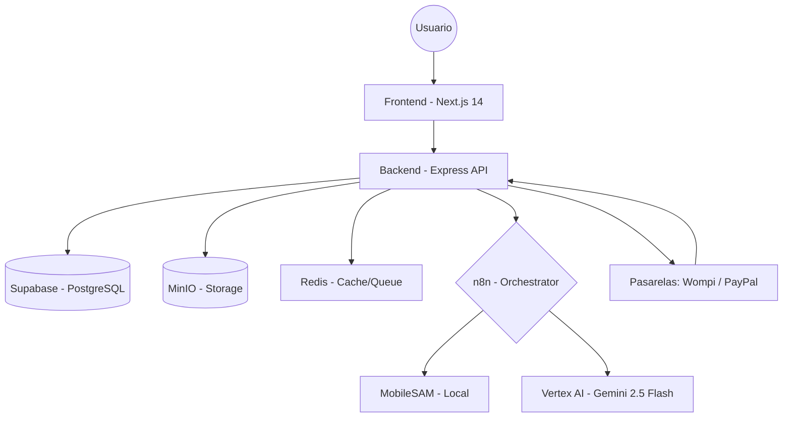

# Mapa Maestro de Arquitectura y Flujos - Lookitry

Este documento visualiza la interconexion entre todos los componentes del sistema, sirviendo como guia de navegacion para desarrolladores y agentes de IA.

**Última actualización:** Mayo 2026

---

## 1. Diagrama de Arquitectura (High Level)

### Stack de IA (Pipeline Try-On)
1. **SAM Local** (`sam-service/`) → Genera máscara de silueta
2. **Vertex AI** (`gemini-2.5-flash-image`) → Genera imagen final

---

## 2. Flujo de Datos del Widget (Try-On)

La joya de la corona del sistema.

1.  **Frontend**: El cliente sube selfie y selecciona producto.
2.  **API Gateway (`POST /api/pruebalo/[slug]/generate`)**:
    - Valida créditos en `brands`.
    - Comprime imágenes (max 1024px, JPEG 85%).
    - Encola trabajo en Redis.
3.  **Queue Worker**:
    - Procesa selfie con **MobileSAM** (máscara PNG).
    - Envía a **Vertex AI** (`gemini-2.5-flash-image`).
    - Guarda resultado en MinIO.
    - Actualiza Supabase (`status = SUCCESS`).
4.  **Frontend**: Polling detecta resultado y muestra imagen.

**Costo por generación:** ~$0.01-0.05 USD

---

## 3. Jerarquia de Rutas y Servicios

### Frontend (Next.js - App Router)
- `src/app/`
    - `dashboard/`: Panel de control de la marca.
    - `admin/`: Panel global de Lookitry.
    - `pruebalo/`: Widget de Try-On.
    - `blog/`: Plataforma de contenido.
- `src/services/`: Clientes HTTP.
- `src/lib/pricing.ts`: Precios dinámicos desde Supabase.

### Backend (Express)
- `src/routes/` (40+ archivos):
    - `auth.routes.ts`: Registro, Login, JWT.
    - `brands.routes.ts`: Perfil y configuración.
    - `products.routes.ts`: CRUD de productos.
    - `pruebalo.routes.ts`: Widget Try-On.
    - `enterprise.routes.ts`: Sincronización masiva.
    - `ai.routes.ts`: AI Product Descriptor.
    - `chat.routes.ts`: WhatsApp Chat.
    - `leadsPublic.routes.ts`: Leads públicos.
- `src/services/`: Lógica pura.
- `src/controllers/`: Handlers de rutas.
- `src/middleware/`: Auth, rate limiting, security.

---

## 4. Persistencia y CDN

- **Supabase** (`vkdooutklowctuudjnkl.supabase.co`): 
    - 57+ tablas (brands, products, generations, etc.)
    - Motores RAG via `pgvector` (768-dim embeddings).
    - Auth JWT propio (no nativo de Supabase).
    - Pricing dinámico via `pricing_config`.
- **MinIO** (`minio.wilkiedevs.com`):
    - Buckets: `lookitry-selfies`, `lookitry-products`, `lookitry-results`.
- **Redis**:
    - Brand config cache (TTL 5 min).
    - Job queue para Try-On.
    - Chat queue para WhatsApp.

---

## 5. Ecosistema de Scripts

Ubicados en `scripts/tools/` (activos) y `scripts/archive/` (diagnóstico).

| Script | Función |
|--------|---------|
| `_deploy_now.py` | Deploy al VPS (inteligente, detecta cambios) |
| `generate_image.py` | Imágenes de marketing con Vertex AI |
| `sync_project_knowledge.py` | Sincroniza docs con Obsidian |

**Otros scripts (en `scripts/archive/`):**
- `check_containers.py`, `check_redis.py`, `check_n8n_*.py` — Diagnóstico

---

## 6. Agentes IA

Configuración en `opencode.json`:
- **sammy** — Orquestador
- **webwizard** — Frontend/UX
- **devguardian** — QA/Security
- **dataalchemist** — DB/IA/n8n
- **growthpilot** — CRM/Marketing
- **architectai** — Infra/DevOps
- **docs-writter** — Documentación
- **security-auditor** — Auditoría

**Modelo default:** `MiniMax-M2.7`