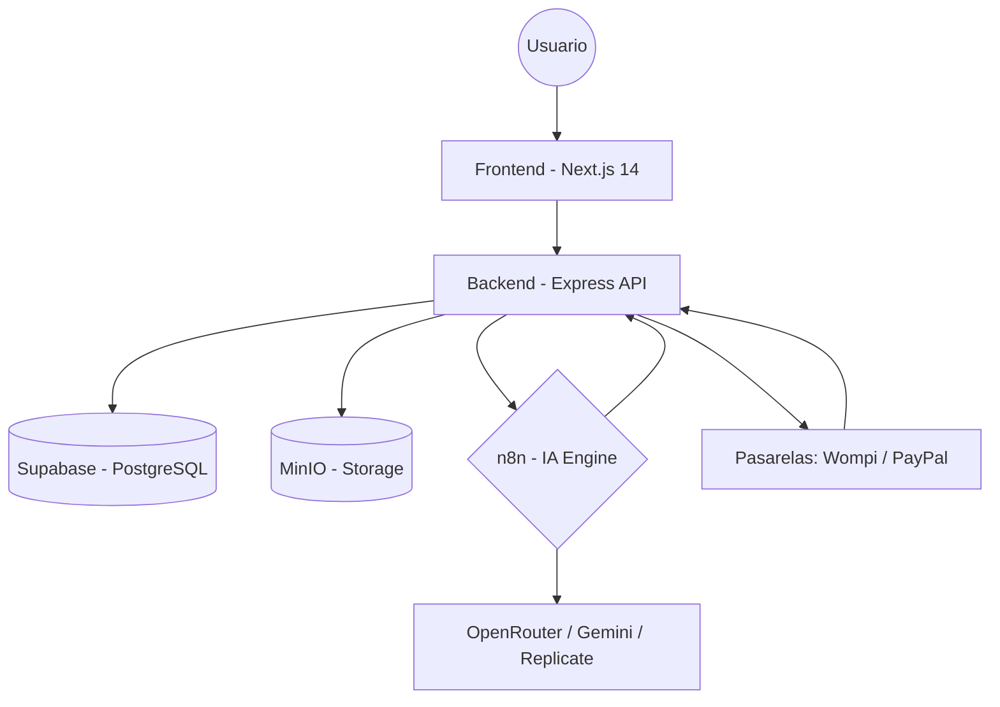

# Mapa Maestro de Arquitectura y Flujos - Lookitry

Este documento visualiza la interconexion entre todos los componentes del sistema, sirviendo como guia de navegacion para desarrolladores y agentes de IA.

---

## 1. Diagrama de Arquitectura (High Level)

---

## 2. Flujo de Datos del Widget (Try-On)

La joya de la corona del sistema.

1.  **Frontend (`/probador-virtual/[slug]`)**: El cliente sube su selfie y selecciona un producto.
2.  **API Gateway (`POST /api/pruebalo/[slug]/generate`)**:
    - Valida creditos en `brands`.
    - Sanitiza imagenes y sube a `MinIO`.
    - Envoca Webhook de **n8n**.
3.  **n8n (`Workflow wPLypk7KhBcFLicX`)**:
    - Procesa imagen con IA.
    - Notifica cumplimiento al Backend.
4.  **Backend (`syncProductWebhook`)**: Guarda resultado en `generations` y actualiza estado.
5.  **Frontend**: Realiza polling hasta mostrar el resultado final.

---

## 3. Jerarquia de Rutas y Servicios

### Frontend (Next.js - App Router)
- `src/app/`
    - `dashboard/`: Panel de control de la marca.
    - `admin/`: Panel global de Lookitry.
    - `probador-virtual/`: El widget embebible.
    - `blog/`: Plataforma de contenido.
- `src/services/`: Clientes HTTP (`api.ts`, `auth.service.ts`).

### Backend (Express)
- `src/routes/`
    - `auth.routes.ts`: Registro, Login, JWT.
    - `brand.routes.ts`: Perfil y configuracion de marca.
    - `enterprise.routes.ts`: Sincronizacion masiva (The Sync).
    - `agent.routes.ts`: Endpoint para agentes de IA internos.
- `src/services/`: Logica pura (`subscription.service.ts`, `lead-enrichment.service.ts`).

---

## 4. Persistencia y CDN

- **Supabase**: 
    - 27 tablas core.
    - Motores RAG via `pgvector`.
    - Auth JWT propio (no nativo de Supabase).
- **MinIO** (`minio.wilkiedevs.com`):
    - Cubeta `images`: Selfies, productos y resultados.
    - CDN optimizado para baja latencia en Try-On.

---

## 5. Ecosistema de Automatizacion (Scripts)

Ubicados en `scripts/` y documentados en `Utilidades_Scripts.md`.

- `_deploy_now.py`: CI/CD manual al VPS de Hostinger.
- `stress_test.py`: Pruebas de carga para el motor de IA.
- `check_integrity.py`: Validador de consistencia DB vs Storage.
- `opencode.json`: Configuracion de Agentes IA que operan el sistema.
