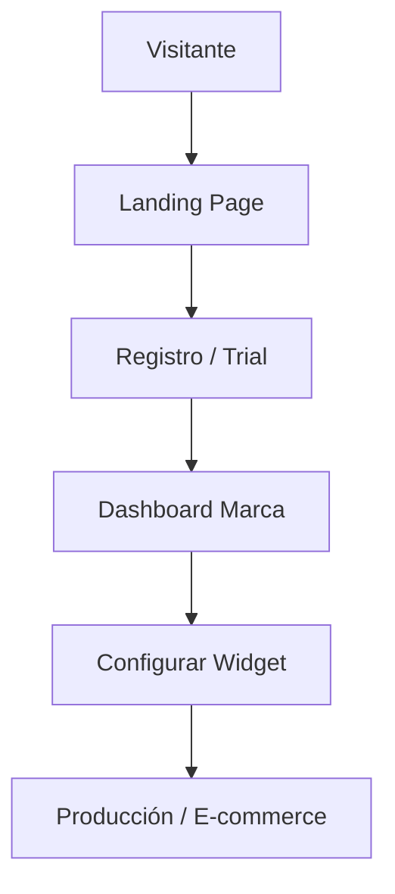

# 🧠 Lookitry Brain (MOC)

Bienvenido al sistema de conocimiento centralizado de **Lookitry**. Esta nota sirve como el mapa de contenido (MOC) para navegar la arquitectura, los procesos y el equipo de agentes que operan este SaaS.

---

## 🏛️ Arquitectura & Stack
- [[TECH_STACK]] — El corazón técnico (Next.js, Express, Supabase, n8n)
- [[PRD]] — Requerimientos y propuesta de valor del producto
- [[DESIGN]] — Sistema de diseño, colores (`#FF5C3A`) y tipografía
- [[Lookitry-brain/infrastructure/Server_VPS]] — Detalles del despliegue en Hostinger

---

## 🤖 Equipo de Agentes (OpenCode)
Cada agente tiene una especialidad y opera bajo el mando de [[Sammy]].
- [[.opencode/agents/sammy|Sammy]] — El Orquestador
- [[.opencode/agents/webwizard|WebWizard]] — Frontend & UX
- [[.opencode/agents/devguardian|DevGuardian]] — Seguridad & Debug
- [[.opencode/agents/dataalchemist|DataAlchemist]] — DB & IA (n8n)
- [[.opencode/agents/architectai|ArchitectAI]] — Infra & DevOps
- [[.opencode/agents/docs-writter|DocsWriter]] — Documentación & QA

---

## 📊 Documentación de Procesos
- [[docs/WIDGET_GUIDE|Guía del Widget]] — Integración vía `/widget.js`
- [[docs/blog/BLOG_ARCHITECTURE_SPLIT|Arquitectura del Blog]] — Cómo funciona el sistema de artículos IA
- [[docs/n8n/N8N_ENTERPRISE_CREDENTIALS_SETUP|Configuración de n8n]] — Workflows y conexión con OpenRouter

---

## 📝 Registro de Actividad
- [[CHANGELOG]] — Últimos cambios realizados en el sistema
- [[REGLAS_IMPORTANTES]] — Lo que NUNCA debe olvidarse al codear en Lookitry
- [[PENDING_TASKS]] — Lo que falta por hacer

---

## 🗺️ Visualización de Datos

> [!TIP]
> Presiona `Ctrl + Click` (Windows) en los enlaces de arriba para navegar rápidamente por el conocimiento del proyecto.
