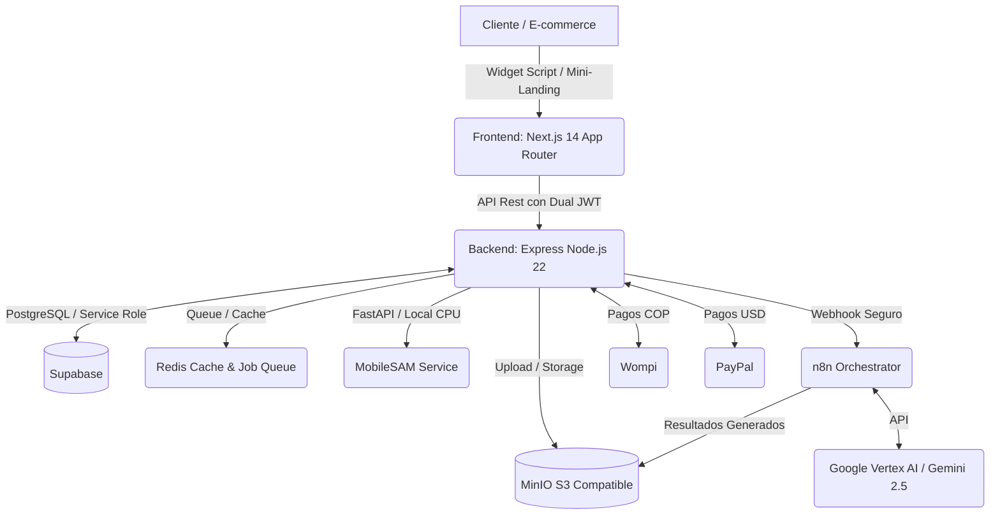

<div align="center">
  

# Lookitry

**El Probador Virtual con Inteligencia Artificial para E-Commerce B2B en Latinoamerica**

[](https://nextjs.org/)
[](https://nodejs.org/)
[](https://expressjs.com/)
[](https://supabase.com/)
[](https://tailwindcss.com/)
[](https://n8n.io/)
[](#)
[](https://paypal.com/)

_Permite a las marcas de moda integrar un widget de prueba virtual en sus tiendas en minutos, reduciendo devoluciones y aumentando la conversion. "Pruebalo antes de comprarlo"._

</div>

---

## Pitch & Propuesta de Valor

Lookitry es una plataforma SaaS B2B diseñada para revolucionar la forma en que se compra ropa, accesorios y calzado en linea en Latinoamerica. Mediante el uso de Inteligencia Artificial avanzada, los clientes finales pueden subir una selfie y visualizar como les quedaria un producto especifico directamente desde la tienda de la marca.

Nuestra solucion se integra de dos maneras principales:
- **Widget Script (`/widget.js`):** Un script liviano y optimizado que inserta el probador virtual como un boton flotante o inline en cualquier plataforma (Shopify, WooCommerce, Wix, o desarrollo a medida).
- **Mini-Landings Personalizables:** Paginas de destino de alto impacto diseñadas con estetica premium donde las marcas pueden dirigir su trafico y permitir la experiencia de prueba sin fricciones.

---

## Arquitectura del Sistema

La arquitectura de Lookitry esta diseñada bajo principios de alta disponibilidad, seguridad estricta y una clara separacion de responsabilidades:



### Flujo de Generacion (Virtual Try-On)
1. **Peticion:** El usuario sube su selfie y selecciona una prenda desde el Frontend.
2. **Validacion:** El Backend valida la sesion, los creditos de la marca y encola el trabajo en Redis.
3. **Segmentacion:** El microservicio local de **MobileSAM** (Python/FastAPI en CPU) genera la mascara de la silueta humana en segundos.
4. **Orquestacion & IA:** Se envia la mascara y el producto al pipeline primario en **Google Vertex AI** utilizando Gemini 2.5 Flash Image para el inpainting de la prenda.
5. **Entrega:** La imagen resultante es optimizada y guardada en el almacenamiento S3 de MinIO, actualizando Supabase para el consumo del cliente final.

---

## Stack Tecnologico

### Frontend
- **Framework:** Next.js 14.2.35 (App Router)
- **Lenguaje:** TypeScript 5.9.3
- **Estilos:** Tailwind CSS 3.4.0 (Sistema de diseño premium con soporte Dark Mode nativo)
- **Animaciones:** Framer Motion & GSAP para micro-interacciones de alta fidelidad
- **Optimizacion:** Sharp para compresion dinamica y entrega de imagenes WebP de ultra-bajo peso

### Backend
- **Runtime:** Node.js 22 + Express (arquitectura modular, limpia y escalable)
- **Seguridad:** 
  - Dual JWT con rotacion de llaves (Access Token + Refresh Token HTTP-only)
  - Rate limiting distribuido por IP apoyado en Redis
  - Proteccion anti-abuso y de formularios con Cloudflare Turnstile
- **Colas y Cache:** Redis (ioredis) para throttling de APIs de IA y procesamiento asincrono de colas

### Base de Datos y Storage
- **Base de Datos:** Supabase (PostgreSQL) con extension pgvector para busqueda semantica en RAG
- **Almacenamiento:** MinIO (S3 compatible) para almacenamiento local y federado de assets

---

## Caracteristicas de Ingenieria Destacadas

- **Conversión de Moneda Inteligente:** Metodo unico aprobado para conversion automatica de COP a USD utilizando la TRM oficial mas un margen de seguridad dinamico, protegiendo las finanzas del SaaS en transacciones internacionales.
- **RAG & Knowledge Base (Rebecca):** Sistema de atencion automatica de ventas via web y WhatsApp que utiliza embeddings vectoriales (Gemini Embedding 001) guardados en pgvector para contestar dudas tecnicas, precios y planes basados en informacion oficial del producto.
- **Optimizacion de Deploys:** Pipelines Docker independientes por servicio (Backend, Frontend, MobileSAM, n8n, Redis) gestionados por Traefik como reverse proxy principal, asegurando cero caidas y despliegues quirurgicos sin sobrecargar la CPU del servidor.
- **Proteccion de APIs:** Middleware de seguridad de widget que verifica origenes permitidos (`allowed_origins`) y caches de configuracion en Redis con TTL de 1 hora, evitando uso no autorizado del script en tiendas no registradas.

---

## Estructura del Repositorio

```
LOOKITRY/
├── frontend/                    # Next.js 14 (App Router) - Panel, checkout, landings
├── backend/                     # Express API (Node 22) - Servicios de negocio, pagos, seguridad
├── sam-service/                 # Python/FastAPI MobileSAM - Segmentacion local de siluetas
├── lookitry-woocommerce/       # Plugin nativo PHP para integracion en tiendas WooCommerce
├── mcp-gcp/                     # GCP MCP Server para automatizaciones de Cloud Storage y Compute
└── error-pages/                 # Docker de paginas de mantenimiento y fallos del sistema
```

---

## Guia de Inicio Rapido (Desarrollo)

### Requisitos Previos
- Node.js >= 20
- pnpm == 9.15.9 (Requerido para evitar vulnerabilidades de paquetes en npm)
- Docker & Docker Compose

### Instalacion

1. Clonar el repositorio:
   ```bash
   git clone https://github.com/depper-IA/Lookitry.git
   cd Lookitry
   ```

2. Configurar variables de entorno:
   - Copiar `frontend/.env.example` a `frontend/.env`
   - Copiar `backend/.env.example` a `backend/.env`

3. Instalar dependencias utilizando pnpm:
   ```bash
   # En la carpeta root (o en cada carpeta de frontend/backend de forma aislada)
   pnpm install
   ```

4. Levantar entorno local con Docker:
   ```bash
   docker compose -f docker-compose.dev.yml up -d
   ```

---

<div align="center">
  <p>Diseñado y construido con pasion para liderar el futuro del e-commerce visual.<br/> <strong>© Lookitry. Todos los derechos reservados.</strong></p>
</div>
