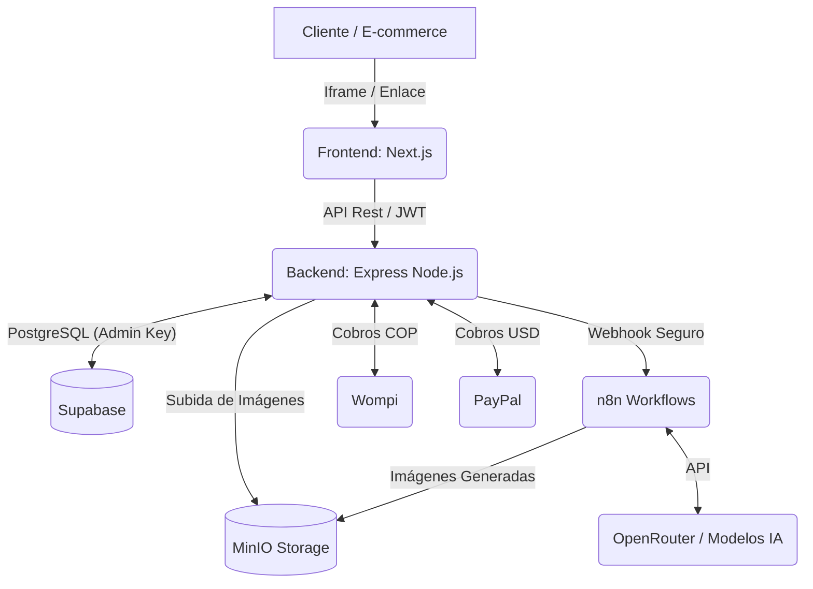

  

# Lookitry

**El Probador Virtual con Inteligencia Artificial para E-Commerce B2B en Latinoamérica**

_Permite a las marcas integrar un widget de prueba virtual en su tienda en minutos, reduciendo devoluciones y aumentando la conversión. "Pruébalo antes de comprarlo"._

---

## Repositorio Privado y Confidencial

**Este repositorio es estrictamente privado y confidencial. No está a la venta ni es de dominio público.**

El código fuente, la arquitectura, los flujos de inteligencia artificial y las estrategias comerciales descritas aquí son propiedad exclusiva de Lookitry. Queda estrictamente prohibida la copia, reproducción, distribución, ingeniería inversa o cualquier intento de replicar esta plataforma sin autorización explícita.

Esta documentación técnica se proporciona únicamente con fines informativos y de visualización estructural para el entendimiento del proyecto a nivel interno.

---

## Propuesta de Valor

Lookitry es una plataforma SaaS B2B diseñada para revolucionar la forma en que se compra ropa, accesorios y calzado en línea. Mediante el uso de Inteligencia Artificial (impulsada por OpenRouter a través de n8n), los clientes finales pueden subir una selfie y visualizar cómo les quedaría un producto específico.

Nuestra solución se integra fácilmente a través de un **widget script** (`/widget.js`) o una **mini-landing page** personalizada, ideal para marcas en Colombia, México, Argentina, Chile y Perú. El método iframe (`/embed/[brandSlug]`) es legacy y solo para casos especiales donde el script no esté disponible.

---

## Stack Tecnológico Premium

La arquitectura de Lookitry está construida para ser rápida, escalable y ofrecer una experiencia premium.

### Frontend

- **Framework:** Next.js 14 (App Router)
- **Lenguaje:** TypeScript
- **Estilos:** Tailwind CSS (Sistema de diseño Dark/Premium)
- **Íconos:** Lucide React
- **Despliegue:** VPS vía Docker

### Backend

- **Framework:** Node.js con Express
- **Lenguaje:** TypeScript
- **Autenticación:** Sistema JWT propio, sólido y seguro (No usamos Supabase Auth).
- **Rate Limiting & Seguridad:** Cloudflare Turnstile integrado para antispam.

### Base de Datos & Almacenamiento

- **Base de Datos:** Supabase (PostgreSQL). Uso estricto de `Service Role` en backend para bypass RLS.
- **Almacenamiento (Storage):** MinIO autohosteado.

### IA & Workflows

- **Orquestador:** n8n
- **Modelos IA:** OpenRouter (para generación de imágenes y descripción de productos).

### Pagos

- **Colombia (COP):** Wompi
- **Internacional (USD):** PayPal (Conversión dinámica vía TRM configurable).

---

## Características Principales

- **Probador Virtual B2B:** Generación de imágenes IA de alta calidad donde el usuario ve la ropa aplicada a su cuerpo.
- **Mini-Landings Personalizables:** Las marcas pueden tener su propia página de prueba con diferentes diseños.
- **Panel Administrativo (Dashboard):** CRUD completo de productos, análisis de uso, estado de suscripción y gestión de facturación.
- **Suscripciones Flexibles:**
  - Sistema de prorrateo automático en upgrades de planes Básico a Pro.
  - Trial inicial guiado con límites de generación de IA.
- **Flujos AI:** Workflows dedicados para el _Try-On_ principal, manejo de errores robusto y descriptor automático de productos.

---

## Arquitectura del Sistema

El ecosistema de Lookitry está diseñado para mantener una separación segura de responsabilidades:

- El **Frontend** nunca accede directamente a la IA ni a secretos de base de datos; actúa como capa de presentación.
- El **Backend** es el proxy seguro que orquesta los pagos, la autenticación y despacha trabajos de IA a n8n.
- **n8n** maneja la lógica compleja de generación, _inpainting_ e inserción de resultados en MinIO, comunicándose de vuelta con el backend y Supabase.

---

## Identidad Visual y Reglas de Diseño (Brand Guardian)

- **Colores Principales:** `#FF5C3A` (Naranja Lookitry - Acento), `#0a0a0a` (Fondo Base), `#141414` (Fondo Cards).
- **Tipografía:** _Plus Jakarta Sans_ para títulos, _DM Sans_ para el cuerpo del texto.
- **Grises (Textos):** Mínimo `#999` para legibilidad. Prohibido usar grises oscuros como `#333`, `#444`, `#555`.
- **Iconografía:** Uso exclusivo de `lucide-react`. Cero emojis en la interfaz.
- **Logotipo:** Siempre en formato SVG acompañado del texto estilizado `Lookitry` (aplicable en código de UI). En documentación, se usará el logo oficial.

---

  
Construido con ❤️ para revolucionar el comercio electrónico.  <strong>© Lookitry. Todos los derechos reservados.</strong>

