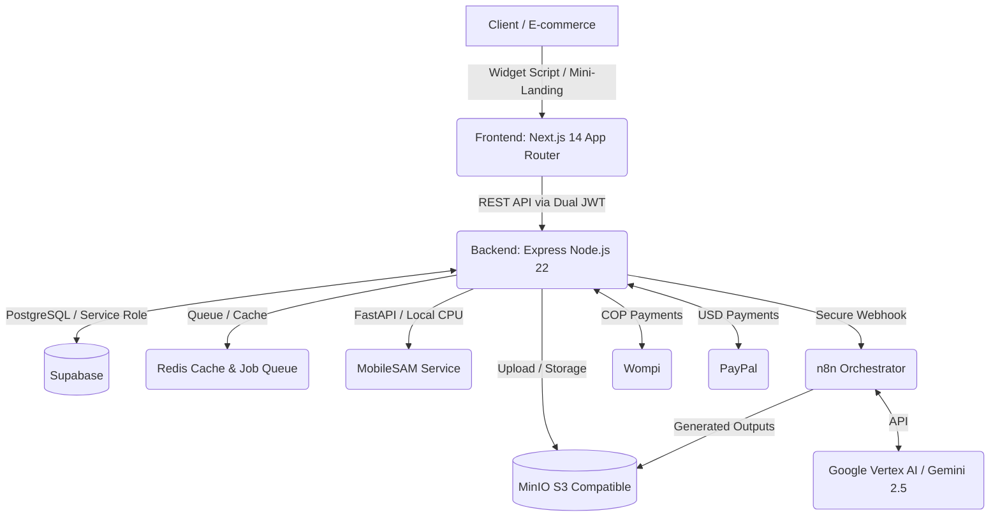

<div align="center">
  

# Lookitry

**AI-Powered Virtual Try-On for B2B E-Commerce in Latin America**

[](https://nextjs.org/)
[](https://nodejs.org/)
[](https://expressjs.com/)
[](https://supabase.com/)
[](https://tailwindcss.com/)
[](https://n8n.io/)
[](#)
[](https://paypal.com/)

_Empower fashion brands to integrate a virtual try-on widget into their stores in minutes, reducing return rates and boosting conversions. "Try it before you buy it."_

</div>

---

## Pitch & Value Proposition

Lookitry is a B2B SaaS platform designed to revolutionize the way fashion, accessories, and footwear are purchased online in Latin America. Powered by advanced artificial intelligence, final customers can upload a selfie and instantly visualize how a specific garment fits them directly from the brand's e-commerce store.

Our solution integrates into stores in two primary ways:
- **Widget Script (`/widget.js`):** A lightweight, highly optimized script that embeds the virtual try-on experience as a floating or inline button on any major e-commerce platform (Shopify, WooCommerce, Wix, or custom developments).
- **Customizable Mini-Landings:** High-converting landing pages designed with premium aesthetics where brands can direct social media traffic to offer friction-free virtual try-on sessions.

---

## System Architecture

Lookitry's architecture is engineered for high availability, robust security, and a strict separation of concerns:



### Virtual Try-On Generation Pipeline
1. **Request:** The user uploads a selfie and selects a garment from the Frontend.
2. **Validation:** The Backend validates the session, confirms available brand credits, and enqueues the job in Redis.
3. **Segmentation:** A dedicated local **MobileSAM** microservice (Python/FastAPI running on CPU) segments the human silhouette and generates a precise PNG mask in seconds.
4. **Inpainting & AI:** The segmented mask and garment image are dispatched to the primary AI pipeline in **Google Vertex AI**, using Gemini 2.5 Flash Image to execute highly realistic garment inpainting.
5. **Delivery:** The generated try-on output is optimized and saved in MinIO's S3-compatible storage, updating Supabase for real-time polling from the client's screen.

---

## Tech Stack

### Frontend
- **Framework:** Next.js 14.2.35 (App Router)
- **Language:** TypeScript 5.9.3
- **Styling:** Tailwind CSS 3.4.0 (Dark-by-default theme with pristine contrast and fluid typography)
- **Motion & Micro-interactions:** Framer Motion & GSAP for high-end cinematic web experiences
- **Image Optimization:** Sharp for on-the-fly compression and ultra-fast WebP delivery

### Backend
- **Runtime:** Node.js 22 + Express (Highly modular, clean, and robust architecture)
- **Security:**
  - Dual-JWT authentication with key rotation (Access Token + Refresh Token stored in HTTP-only cookies)
  - Distributed Redis-backed Rate Limiting to prevent API abuse
  - Form protection and anti-spam supported by Cloudflare Turnstile
- **Cache & Throttling:** Redis (ioredis) for caching metadata and scheduling background task queues

### Database & Storage
- **Database:** Supabase (PostgreSQL) leveraging pgvector for RAG vector similarity search
- **Storage:** MinIO (S3-compatible) for local and federated assets, protecting client data privacy

---

## Core Engineering Highlights

- **Dynamic Currency Conversion:** An elite, secure system to automatically convert COP plans to USD based on the real-time TRM plus a dynamic safety margin, protecting SaaS unit economics.
- **RAG & Knowledge Base (Rebecca):** A fully automated sales and customer-service assistant (available on web and WhatsApp) that leverages pgvector and Gemini Embedding 001 to resolve brand FAQs, feature details, and onboarding queries directly from official documentation.
- **Microservice Container Deploys:** Dockerized service isolation (Backend, Frontend, MobileSAM, n8n, Redis) behind Traefik as the main reverse proxy, permitting surgical zero-downtime updates.
- **API Widget Protection:** A security middleware checking authorized origins (`allowed_origins`) combined with 1-hour Redis configuration caching to prevent script hijacking and hotlinking.

---

## Repository Structure

```
LOOKITRY/
├── frontend/                    # Next.js 14 App Router - Dashboards, checkout, landings
├── backend/                     # Express API (Node 22) - Core business logic, payments, security
├── sam-service/                 # Python/FastAPI MobileSAM - On-premise human segmentation
├── lookitry-woocommerce/       # Native PHP WordPress plugin for custom WooCommerce setups
├── mcp-gcp/                     # GCP MCP Server for cloud storage & compute automation tasks
└── error-pages/                 # Maintenance & graceful error landing pages
```

---

## Quick Start (Development)

### Prerequisites
- Node.js >= 20
- pnpm == 9.15.9 (Mandatory to avoid npm package vulnerability exploits)
- Docker & Docker Compose

### Local Setup

1. Clone the repository:
   ```bash
   git clone https://github.com/depper-IA/Lookitry.git
   cd Lookitry
   ```

2. Configure environment variables:
   - Copy `frontend/.env.example` to `frontend/.env`
   - Copy `backend/.env.example` to `backend/.env`

3. Install packages via pnpm:
   ```bash
   pnpm install
   ```

4. Spin up local development containers:
   ```bash
   docker compose -f docker-compose.dev.yml up -d
   ```

---

<div align="center">
  <p>Designed and built with passion to lead the future of visual commerce.<br/> <strong>© Lookitry. All rights reserved.</strong></p>
</div>
