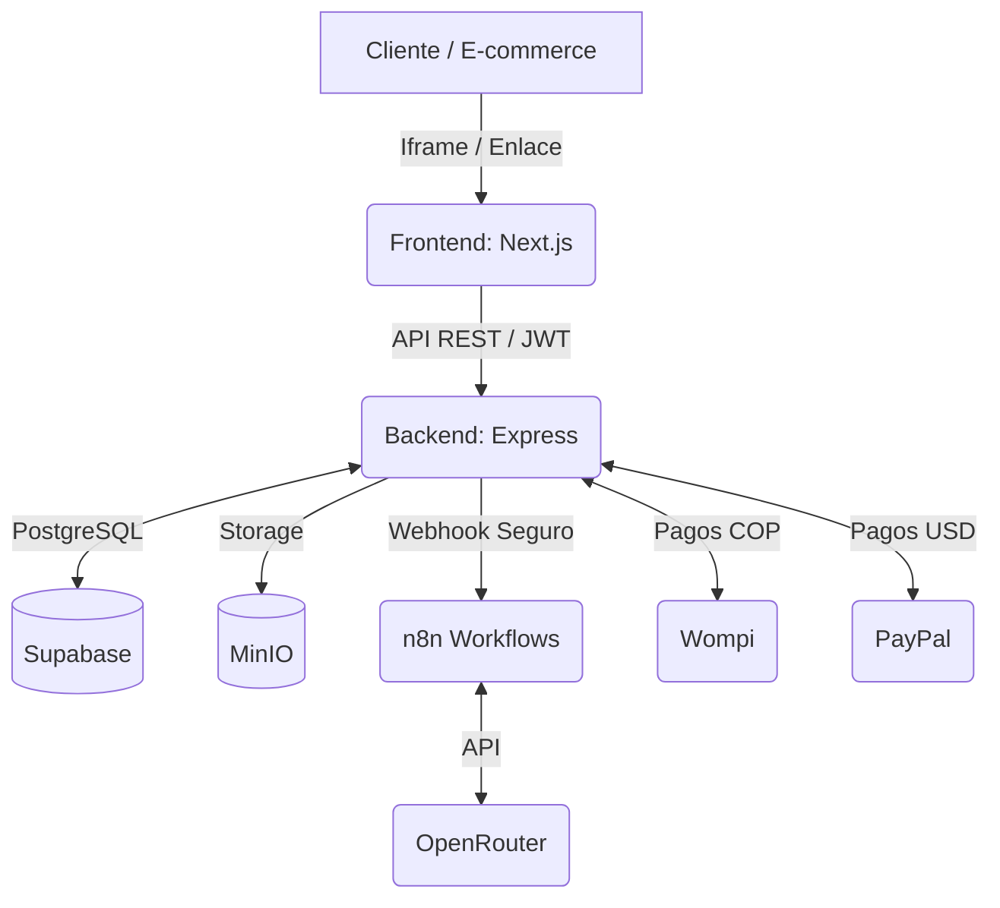

<div align="center">
  

# Lookitry

**El Probador Virtual con Inteligencia Artificial para E-Commerce B2B en Latinoamérica**

[](https://nextjs.org/)
[](https://nodejs.org/)
[](https://expressjs.com/)
[](https://supabase.com/)
[](https://tailwindcss.com/)
[](https://n8n.io/)
[](#)
[](https://paypal.com/)

Permite a las marcas integrar un widget de prueba virtual en su tienda en minutos, reduciendo devoluciones y aumentando la conversión. "Pruébalo antes de comprarlo".

[Ver Demo](https://lookitry.com) · [Reportar Bug](https://github.com/depper-IA/Lookitry/issues) · [Solicitar Feature](https://github.com/depper-IA/Lookitry/issues)

</div>

---

## Propuesta de Valor

**Lookitry** es una plataforma SaaS B2B diseñada para transformar la compra de ropa, accesorios y calzado en línea. Mediante el uso de Inteligencia Artificial a través de n8n y OpenRouter, los clientes finales pueden subir una selfie y visualizar cómo les quedaría un producto específico antes de comprar.

La solución se integra mediante un widget embebible o una mini-landing personalizada, orientada a marcas de moda en Colombia y otros mercados de Latinoamérica.

---

## Stack Tecnológico

### Frontend

- **Framework:** Next.js 14 (App Router)
- **Lenguaje:** TypeScript
- **Estilos:** Tailwind CSS
- **Iconografía:** Lucide React
- **Despliegue:** Docker en VPS

### Backend

- **Framework:** Node.js con Express
- **Lenguaje:** TypeScript
- **Autenticación:** JWT propio
- **Seguridad:** Cloudflare Turnstile, middleware de administración y validaciones de backend

### Base de Datos y Almacenamiento

- **Base de Datos:** Supabase PostgreSQL
- **Storage:** MinIO autohosteado

### IA y Automatización

- **Orquestador:** n8n
- **Modelos:** OpenRouter

### Pagos

- **Colombia:** Wompi (COP)
- **Internacional:** PayPal (USD)

---

## Capacidades Principales

- Probador virtual B2B para catálogos de moda.
- Mini-landings personalizables por marca.
- Dashboard para gestión de productos, analítica, suscripción y configuración.
- Planes `TRIAL`, `BASIC`, `PRO` y flujos manuales para `ENTERPRISE`.
- Integración de pagos con Wompi y PayPal.
- Workflows n8n para generación de contenido y procesos operativos.
- Sistema antiabuso para trial y registro.

---

## Arquitectura del Sistema



El detalle operativo completo del sistema vive en `REGLAS_IMPORTANTES.md`.

---

## Instalación y Desarrollo Local

### Requisitos Previos

- Node.js 18 o superior
- Proyecto Supabase configurado
- Instancia de n8n configurada
- MinIO y SMTP disponibles si vas a probar flujos completos

### 1. Clonar el repositorio

```bash
git clone https://github.com/depper-IA/Lookitry.git
cd Lookitry
```

### 2. Configurar el backend

```bash
cd backend
npm install
```

Crea `.env` a partir de `.env.example` y completa las variables necesarias.

```bash
npm run dev
```

La API quedará disponible en `http://localhost:3001`.

### 3. Configurar el frontend

En otra terminal:

```bash
cd frontend
npm install
```

Crea `.env.local` a partir de `.env.example`.

```bash
npm run dev
```

La app quedará disponible en `http://localhost:3000`.

---

## Variables de Entorno

### Backend (`backend/.env`)

No expongas `SUPABASE_SERVICE_KEY` en frontend.

```env
PORT=3001
SUPABASE_URL=https://tu-proyecto.supabase.co
SUPABASE_ANON_KEY=eyJ...
SUPABASE_SERVICE_KEY=eyJ...
JWT_SECRET=tu_secreto_jwt
N8N_WEBHOOK_URL=https://n8n.tudominio.com/webhook/tryon
N8N_API_KEY=eyJ...
N8N_BEARER_TOKEN=*********
WOMPI_PUBLIC_KEY=pub_test_...
WOMPI_PRIVATE_KEY=prv_test_...
WOMPI_EVENTS_SECRET=test_events_...
***REMOVED-SECRET***test_integrity_...
WOMPI_ENABLED=true
TURNSTILE_SECRET_KEY=0x4AAAA...
TURNSTILE_ENABLED=true
SMTP_HOST=smtp.hostinger.com
SMTP_PORT=465
SMTP_USER=info@lookitry.com
SMTP_PASS=********
MINIO_ENDPOINT=https://minio.tudominio.com
MINIO_BUCKET=images
MINIO_ACCESS_KEY=TuAccessKey
MINIO_SECRET_KEY=TuSecretKey
FRONTEND_URL=http://localhost:3000
```

### Frontend (`frontend/.env.local`)

```env
NEXT_PUBLIC_API_URL=http://localhost:3001
NEXT_PUBLIC_APP_URL=http://localhost:3000
NEXT_PUBLIC_SUPABASE_URL=https://tu-proyecto.supabase.co
NEXT_PUBLIC_SUPABASE_ANON_KEY=eyJ...
NEXT_PUBLIC_TURNSTILE_SITE_KEY=0x4AAAAAACsmy7e_yL9iyAXM
```

---

## Resumen de API

| Método | Endpoint | Autenticación | Descripción |
| ------ | -------- | ------------- | ----------- |
| `POST` | `/api/auth/register` | Público | Registro de marca |
| `POST` | `/api/auth/login` | Público | Login y generación de JWT |
| `GET` | `/api/products` | JWT | Listar productos de la marca |
| `POST` | `/api/generations` | JWT | Iniciar un try-on |
| `GET` | `/api/pruebalo/:slug` | Público | Configuración pública del widget |
| `GET` | `/api/payments/wompi/checkout-url` | Público/JWT | Crear checkout Wompi |
| `POST` | `/api/payments/wompi/webhook` | Firma Wompi | Confirmar pagos Wompi |

Revisa `backend/src/controllers` y `backend/src/routes` para el detalle completo.

---

## Deploy

Lookitry se despliega a un VPS usando Docker Compose y el script `scripts/_deploy_now.py`.

No hagas deploy sin autorización explícita.

```bash
git pull origin main --rebase
git push origin main

python scripts/_deploy_now.py --no-cache
python scripts/_deploy_now.py --frontend
python scripts/_deploy_now.py --backend
python scripts/_deploy_now.py --restart
```

---

## Diseño y Gobernanza

- Color principal: `#FF5C3A`
- Fondo base: `#0a0a0a`
- Cards: `#141414`
- Tipografías: Plus Jakarta Sans y DM Sans
- Sin emojis en UI
- Logo siempre en SVG con la marca Lookitry

Consulta `REGLAS_IMPORTANTES.md` para lineamientos completos de arquitectura, branding, pagos, trial, deploy y operación.

---

## Persistencia y Changelog

Cualquier cambio realizado en el proyecto debe quedar documentado en `CHANGELOG_GEMINI.md`.

Los agentes que trabajen sobre este repositorio deben revisar `REGLAS_IMPORTANTES.md` antes de intervenir el sistema.
