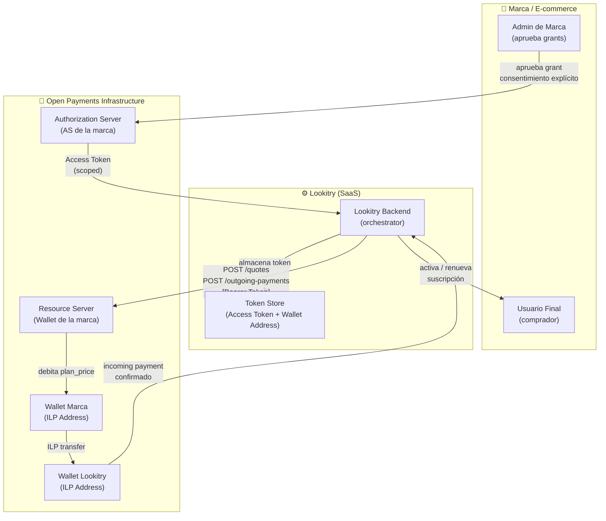
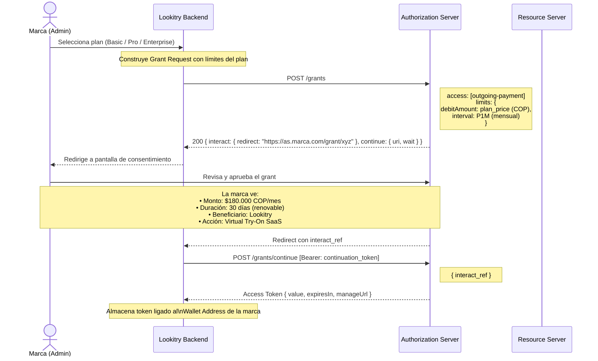
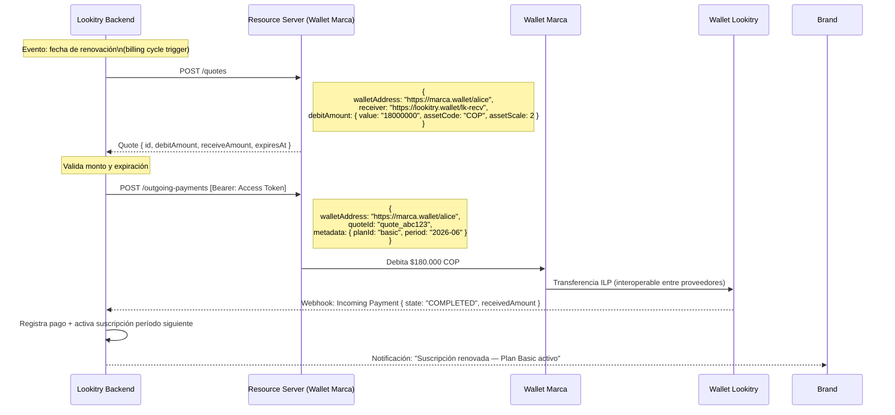
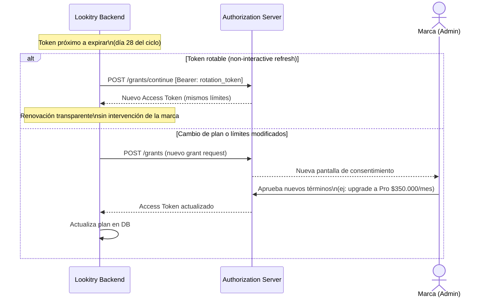
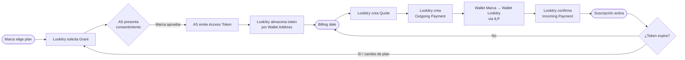

# Open Payments — Lookitry Subscription Billing

> Flujo de cobro automático de suscripciones (Basic / Pro / Enterprise) desde la wallet de la marca hacia la wallet de Lookitry, usando el protocolo Open Payments (GNAP + ILP).

---

## Arquitectura de actores

---

## Fase 1 — Onboarding & Grant

---

## Fase 2 — Cobro mensual automático

---

## Fase 3 — Renovación o cambio de plan

---

## Resumen del flujo completo

---

## Referencia de objetos Open Payments

| Objeto | Quién lo crea | Para qué |
|--------|--------------|----------|
| **Grant** | Lookitry → AS de la marca | Solicitar permiso para cobrar |
| **Access Token** | Authorization Server | Autorizar a Lookitry a actuar en nombre de la marca |
| **Wallet Address** | Cada proveedor de wallet | Identificador ILP de cada cuenta |
| **Quote** | Lookitry → Resource Server | Calcular monto exacto + tipo de cambio |
| **Outgoing Payment** | Lookitry → Resource Server | Ejecutar el débito desde la wallet de la marca |
| **Incoming Payment** | Wallet de Lookitry | Confirmar que los fondos llegaron |

---

## Planes y montos

| Plan | Monto mensual | Asset | Intervalo |
|------|--------------|-------|-----------|
| Basic | $180.000 COP | COP, scale 2 | P1M |
| Pro | $350.000 COP | COP, scale 2 | P1M |
| Enterprise | $800.000+ COP | COP / USD | P1M (negociable) |

Para pagos internacionales (USD), el Resource Server resuelve la conversión vía ILP antes de crear el Outgoing Payment. Lookitry recibe en COP o USD según su Wallet Address.

---

## Beneficios clave vs. modelo actual

| Capacidad | Modelo actual (Wompi/PayPal) | Open Payments |
|-----------|------------------------------|---------------|
| Cobro automático | Manual / link de pago | Automático vía Access Token |
| Consentimiento explícito | Fuera de banda | Nativo en el protocolo (GNAP) |
| Interoperabilidad de wallets | No (solo Wompi o PayPal) | Sí — cualquier wallet ILP |
| Pagos transfronterizos | PayPal únicamente | Nativo — ILP resuelve FX |
| Límites de gasto auditables | No | Sí — encoded en el Grant |
| Sin datos de tarjeta | No | Sí — cero PCI scope |
| Revocación inmediata | No | Sí — el AS puede revocar el token |
